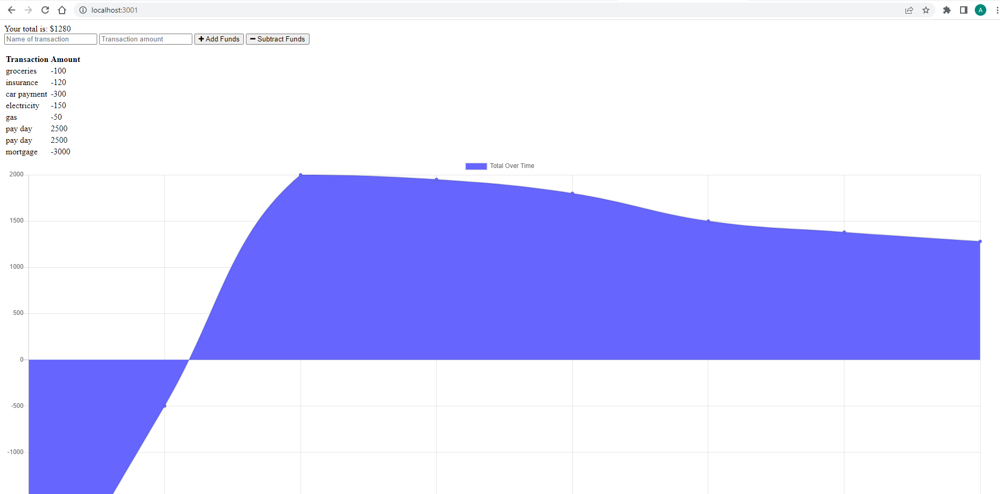

# budget-tracker

## Name

Budget Tracker

## Description

Budget Tracker allows the user to input the name of a transaction, the amount of the transaction, and then whether or not the amount of the funds need to be added or subtracted. Once funds are inputed, a transaction amount will list all previous transactions with the corresponding name. Below, a chart representing the user's transaction history will be generated.

## Visuals

## Technology/Framework used

- JavaScript
- Mongoose.js
- Express.js
- Morgan
- Compression
- Node.js

## Installation

- npm i
- npm start

## Contributor

* Alex Scott

## Questions

github.com/alexhscott
alexhscott@gmail.com